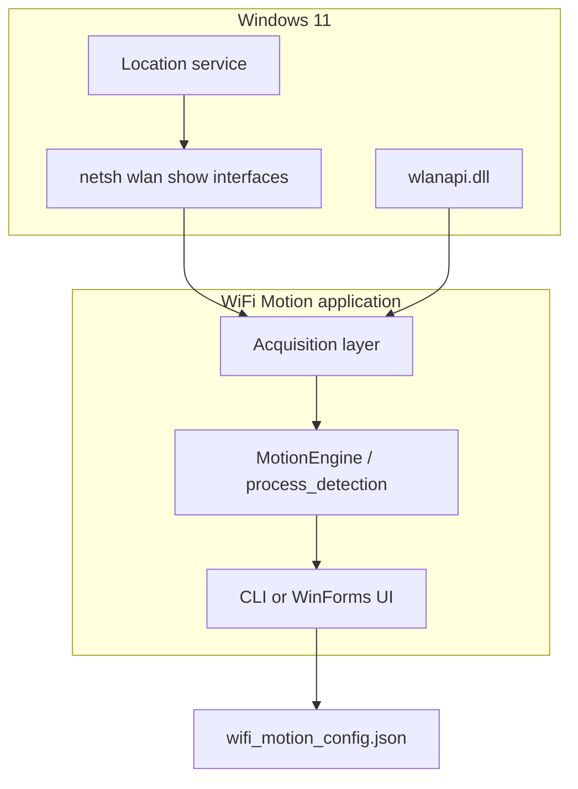

# WiFi Motion — Technical Architecture

This document describes how the WiFi Motion system is structured, how data flows from the OS to motion events, and how the Python and .NET implementations relate.

---

## 1. Purpose and scope

The system is a **single-machine, passive RF sensing application** on Windows 11. It does not inject packets or require special CSI hardware. It observes:

1. **Connected-interface RSSI** via `netsh wlan show interfaces`
2. **Nearby BSS entries** (up to six AP slots) via `wlanapi.dll`

From these streams it computes statistical features, compares them to calibrated thresholds, and emits **motion start / motion end** events with optional magnitude labels, FFT hints, and coarse spatial hints.

Both codebases implement the **same detection pipeline**; differences are mainly in UI, threading, WLAN struct correctness, and optional MCP integration (Python only).

---

## 2. System context



**Privilege model:** Administrator elevation is required so `netsh` and WLAN API calls succeed. **Location** must be enabled or `netsh` returns no RSSI (privacy gate on Windows).

---

## 3. Repository layout (logical)

| Layer | Python (`python/`) | .NET (`WifiMotionDotNet/WifiMotion/`) |
|-------|-------------------|--------------------------------------|
| Entry | `wifi_motion.py` → `main()` | `Program.cs` → `MainForm` |
| Acquisition | `lib/rssi_reader.py`, `lib/wlan_api.py` | `Core/RssiReader.cs`, `Core/WlanApi.cs` |
| Math | `lib/stats.py` | `Core/Stats.cs` |
| Config / state | `lib/config.py` | `Core/Settings.cs`, `Core/DetectionState.cs` |
| Pipeline | functions in `wifi_motion.py` | `Core/MotionEngine.cs` |
| Remote control | `wifi_motion_server.py` (MCP) | — |
| Tests / export | `test_runner.py`, matplotlib heatmaps | `Testing/*`, GDI+ heatmaps |

Shared artifact: **`wifi_motion_config.json`** (same JSON field names, e.g. `threshold_var`, `SOUND_ALARM`).

---

## 4. Layered architecture

```
┌─────────────────────────────────────────────────────────────┐
│  Presentation                                                 │
│  Python: curses-like console redraw (show_status)             │
│  .NET:   MainForm, RssiGraphControl, TestMenuForm             │
├─────────────────────────────────────────────────────────────┤
│  Application orchestration                                    │
│  Python: main key-loop, setup_wizard, elevate()             │
│  .NET:   LoopBody thread, Start/Stop/Calibrate, test hooks    │
├─────────────────────────────────────────────────────────────┤
│  Detection pipeline (MotionEngine / process_detection)        │
│  calibrate → [loop: read → check → confirm → handle → …]    │
├─────────────────────────────────────────────────────────────┤
│  Signal processing (Stats)                                    │
│  variance (mW domain), delta, PTP, FFT, sensitivity curve     │
├─────────────────────────────────────────────────────────────┤
│  Acquisition                                                  │
│  RssiReader (netsh)  +  WlanApi (scan, BSS list)              │
├─────────────────────────────────────────────────────────────┤
│  Windows WLAN stack                                           │
└─────────────────────────────────────────────────────────────┘
```

The **detection pipeline is UI-agnostic**. In .NET, `MotionEngine` raises events (`MotionStarted`, `MotionEnded`, `StatusChanged`); the form subscribes and marshals updates to the UI thread.

---

## 5. Data acquisition

### 5.1 Primary RSSI path (`netsh`)

`RssiReader.GetRssi()` / `get_rssi()` spawns:

```text
netsh wlan show interfaces
```

and parses (Turkish or English locale):

| Field | Use |
|-------|-----|
| Signal % | Display |
| RSSI (dBm) | Core metric; drives VAR/DEL/PTP window |
| Receive / transmit rate (Mbps) | RX variance metric; FFT auxiliary |

Failure modes: timeout, “location permission”, “access denied” → cycle skipped (`ReadSignal` returns `false`).

### 5.2 Secondary AP path (`wlanapi.dll`)

`WlanApi` lifecycle:

1. `WlanOpenHandle` → negotiate version 2  
2. `WlanEnumInterfaces` → pick first wireless interface GUID  
3. Periodically `WlanScan` (optional trigger scan ~2 s)  
4. `WlanGetNetworkBssList` → walk `WLAN_BSS_ENTRY` records  

Each BSS yields: SSID, BSSID, RSSI, link quality, channel frequency (kHz → channel number).

**Up to six** strongest entries become `ApSlot` objects with per-BSSID rolling `History` (length ≤ `window`).

**.NET fix vs Python:** The Python `ctypes` layout for `WLAN_BSS_ENTRY` omitted `dot11BssPhyType` and mis-sized fields, which skewed RSSI/channel reads. The C# port uses explicit offsets (`BssEntrySize = 360`, `OffRssi = 56`, `OffChFreq = 92` in kHz) aligned to the Windows SDK.

---

## 6. State model

### 6.1 Settings (persistent)

Loaded from `wifi_motion_config.json`. Key parameters:

| Parameter | Role |
|-----------|------|
| `window` | Sliding buffer length for VAR/PTP (default 10 samples) |
| `calib_samples` | Calibration duration in seconds (1 sample/s) |
| `threshold_var` / `threshold_delta` / `threshold_ptp` | Detection thresholds (post-calibration) |
| `sensitivity` | Maps to multiplier + minimum floors via `Stats.SensitivityParams` |
| `motion_confirm` | Consecutive hit frames required before “motion” (default 2) |
| `cooldown` | Frames to suppress repeat status after a trigger |
| `motion_confirm`, `position_settle_frames` | Debounce and long-motion baseline reset |
| `ap_scan_interval` | Frames between `ScanAps` |
| `fft_interval` | Frames between dominant-frequency estimate |
| `ewma_alpha` | Baseline smoothing for displayed “baseline dBm” |
| `rx_var_threshold` | RX rate variance tripwire |

### 6.2 DetectionState (runtime)

Ephemeral buffers and flags:

- **History** — last `window` dBm samples for connected interface  
- **GraphHist** — longer series for on-screen graph / FFT (width `graph_w`)  
- **RxHist** — receive rate samples for `rx_var`  
- **ApSlots** — list of neighbor APs with enabled flag and history  
- **MotionConsec**, **MotionNow**, **PrevMotionState** — edge detection  
- **PeakVar**, **MotionCooldown**, **SustainedMotionFrames** — event shaping  
- **EwmaDbm**, **BaselineDbm** — tracked quiet level  
- **FftFreq**, **FftLabel** — motion class hint (breath / walk bands)

---

## 7. Signal processing

### 7.1 Why linear power (mW)

RSSI is logarithmic (dBm). **Variance for motion** is computed in **milliwatt space**:

```text
mW_i = 10^(dBm_i / 10)
VAR = sample variance of {mW_i}
```

This matches physical power fluctuation better than variance on dBm directly (`Stats.Variance(..., linearPower: true)`).

### 7.2 Metrics per frame

After each successful read:

| Metric | Formula (conceptual) | Detects |
|--------|----------------------|---------|
| **VAR** | Variance of `History` in mW | Sustained / slow movement |
| **DEL** | \|dBmₜ − dBmₜ₋₁\| | Fast transients |
| **PTP** | max(History) − min(History) | Overall swing in window |
| **RXv** | Variance of `RxHist` in mW | Link-rate instability |

**Slot hit:** Same three thresholds applied independently to each **enabled** AP slot history (minimum 3 samples).

### 7.3 Sensitivity curve

`Stats.SensitivityParams(level)` for `level ∈ [0.1, 15.0]`:

- Returns `(multiplier, minVar, minDel, minPtp)`  
- Higher sensitivity number → **lower** multiplier → **easier** triggering  
- Calibration sets:  
  `threshold_* = max(min_*, baseline_* × multiplier)`

### 7.4 FFT branch (optional classification)

Every `fft_interval` frames, if ≥ 16 graph samples:

1. Estimate sample rate from `Timestamps`  
2. Run DFT (`Stats.DominantFreq`) on detrended `GraphHist`  
3. Map dominant Hz to label: still / breath / small motion / walking bands  

Used for status display and expert tests—not for the primary boolean motion gate.

### 7.5 Spatial hint (heuristic)

When ≥ 2 AP slots enabled, compare per-AP variance; if one AP dominates (>1.5×), emit a coarse “toward SSID” string. **Not triangulation**—requires CSI or dense AP geometry for real positioning.

---

## 8. Detection pipeline (one cycle)

Both stacks execute the same ordered steps (`process_detection` / `MotionEngine.ProcessDetection`):

```mermaid
sequenceDiagram
    participant Loop as Main loop (~300ms)
    participant Read as ReadSignal
    participant Check as CheckMotion
    participant Handle as HandleMotionEvent
    participant Base as UpdateBaseline
    participant FFT as UpdateFft

    Loop->>Read: netsh + optional AP scan
    alt dbm is null
        Read-->>Loop: abort cycle
    end
    Loop->>Check: raw_hit, slot_hit
    Loop->>Loop: motion_consec++, confirm >= motion_confirm
    Loop->>Handle: rising/falling edges, cooldown, logs
    Loop->>Base: EWMA + position settle reset
    Loop->>FFT: periodic frequency label
    Loop->>Loop: spatial hint, snapshot, trim logs
```

### 8.1 Confirmation and edges

```text
if raw_hit OR slot_hit:
    motion_consec++
else:
    motion_consec = 0

motion_now = (motion_consec >= motion_confirm)
rising_edge = motion_now AND NOT prev_motion_state
```

Default `motion_confirm = 2` filters single-sample spikes.

### 8.2 Cooldown and sustained motion

- On confirmed motion: `MotionCooldown` reset; status message throttled by cooldown frames  
- `PeakVar` tracks maximum VAR during event  
- After `position_settle_frames` of sustained motion, **baseline reset** clears motion state (adapts to new “still” posture)

### 8.3 Calibration phase

`CalibrateAsync` / `calibrate()`:

1. For `calib_samples` iterations (1 Hz): read RSSI, collect deltas and sliding PTP  
2. Compute mean baselines for VAR/DEL/PTP windows  
3. Apply sensitivity multiplier and minimum floors  
4. Seed `History`, `EwmaDbm`, `BaselineDbm`, `RxHist`

User must remain **still** during calibration; thresholds encode the quiet environment.

---

## 9. Concurrency and threading

### 9.1 Python CLI

- **Single-threaded** main loop: blocking `input` / key poll + `process_detection()` when running  
- `netsh` and WLAN calls run on the same thread (UI freeze during slow netsh)  
- MCP server (`wifi_motion_server.py`): separate **detection thread** with locks on AP slots and shared `SETTINGS` / `STATE`

### 9.2 .NET WinForms

| Thread | Responsibility |
|--------|----------------|
| UI (STA) | Controls, keyboard shortcuts, `SafeInvoke` refresh |
| `DetectionLoop` (background) | `ProcessDetection()` every ~300 ms when `Running` |
| `Task.Run` | Initial `WlanApi.Init()`, `ScanAps(trigger)`, calibration `GetRssi` |

`MotionEngine` has no UI references; cross-thread UI updates use `Control.Invoke`.

**Single instance:** Mutex `WifiMotionCli_SingleInstance` (Python uses PID file + optional second instance prompt).

---

## 10. Presentation layer differences

### Python

- Full-screen terminal redraw (`show_status`)  
- ASCII RSSI sparkline (`_rssi_graph`)  
- Admin elevation via `elevate()` re-launch  
- Setup wizard for location / RSSI smoke test  
- Optional **MCP tools** exposing start/stop/calibrate/status to Claude Code  

### .NET

- `MainForm`: toolbar, threshold numeric controls, AP checklist, live `RssiGraphControl`  
- `System.Media` for alarm (config `SOUND_ALARM`)  
- Built-in **test runner UI** → CSV + 4-panel PNG heatmap (`HeatmapGenerator`, GDI+)  
- `app.manifest`: `requireAdministrator` (UAC on launch)

---

## 11. Testing and recording subsystem (.NET-focused)

When a test is active, each detection cycle appends to `TestRecording`:

- Timestamped samples: dBm, %, VAR, DEL, PTP, RX/TX rates  
- Per-AP RSSI snapshots  

On completion:

- **CSV** under `test_output/`  
- **Heatmap PNG** (RSSI timeline, metrics, AP heat strip, RX/TX)  

Python uses the same concepts via `test_runner.py` with matplotlib for heatmaps.

---

## 12. Logging

| File | Content |
|------|---------|
| `motion_log.txt` | Motion start/end lines with causes and AP summary |
| `rssi_log.txt` | Periodic snapshots (VAR/DEL/PTP vs thresholds, FFT label) |

Both implementations trim logs to ~5000 lines.

---

## 13. Security and privacy boundaries

- Reads **only local** WLAN status; no cloud upload in core app  
- Requires broad OS permissions (admin + location) inherent to RSSI APIs on Windows  
- MCP server extends attack surface if exposed—intended for local dev tooling only  

---

## 14. Known architectural limitations

1. **No true localization** — single adapter + RSSI variation; spatial hint is variance comparison across APs, not TDOA/CSI.  
2. **Environment drift** — furniture moves or new devices change multipath; recalibration required.  
3. **Sampling rate ~1–2 Hz** — driven by netsh subprocess latency and 300 ms loop sleep (.NET); limits FFT resolution.  
4. **Platform lock-in** — Windows 11 WLAN stack only; no Linux/macOS path in this repo.  
5. **Python WLAN struct bug** — fixed in C# port; Python AP metrics may be less trustworthy until struct is patched upstream.  

---

## 15. Extension points

| Change | Touch points |
|--------|----------------|
| New metric | `Stats.cs` / `stats.py`, `_check_motion`, UI threshold controls |
| Faster sampling | Replace or cache `netsh` (e.g. persistent WLAN notification API— not implemented) |
| Cloud alerts | Subscribe to `MotionStarted` / MCP tool wrapper |
| Cross-platform | New acquisition backend; keep pipeline interface |

---

## 16. Reference: Python ↔ C# symbol map

| Python | C# |
|--------|-----|
| `process_detection` | `MotionEngine.ProcessDetection` |
| `_read_signal` | `ReadSignal` |
| `_check_motion` | `CheckMotion` |
| `_handle_motion_event` | `HandleMotionEvent` |
| `_update_baseline` | `UpdateBaseline` |
| `_update_fft` | `UpdateFft` |
| `calibrate` | `CalibrateAsync` |
| `scan_aps` | `ScanAps` |
| `get_rssi` | `RssiReader.GetRssi` |
| `WlanApi` | `WlanApi` |
| `Settings` / `DetectionState` | `Settings` / `DetectionState` |
| `variance`, `dominant_freq`, … | `Stats.*` |

---

## 17. Further reading

- Root overview: [`README.md`](README.md)  
- Portfolio & roadmap: [`PORTFOLIO.md`](PORTFOLIO.md)  
- Python usage: [`python/README.md`](python/README.md)  
- .NET build & UI: [`WifiMotionDotNet/README.md`](WifiMotionDotNet/README.md)  

