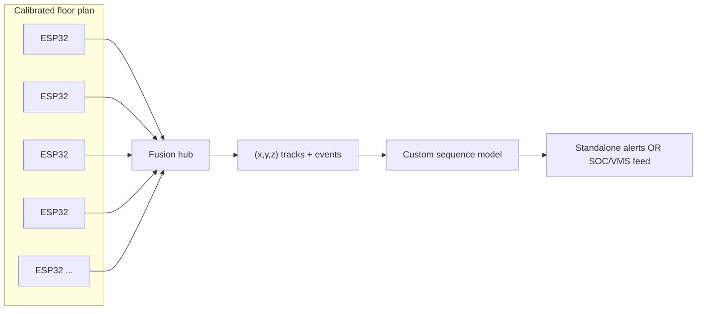
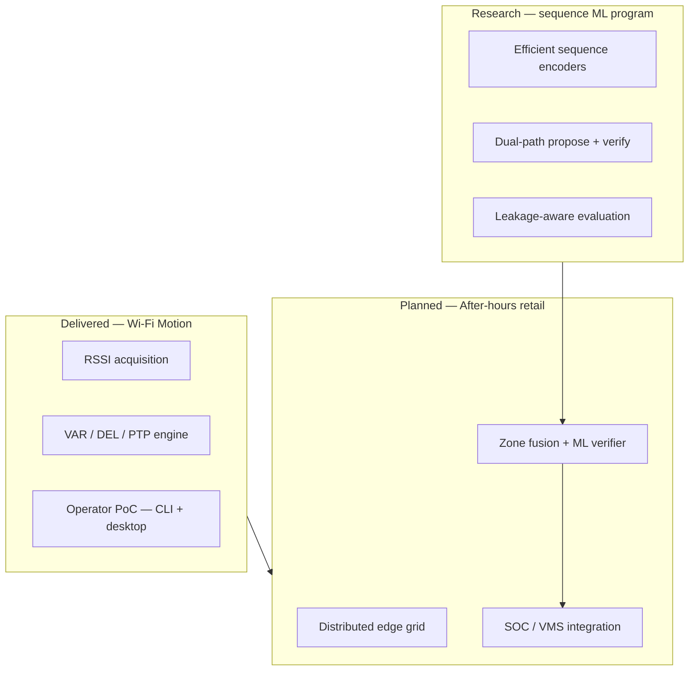
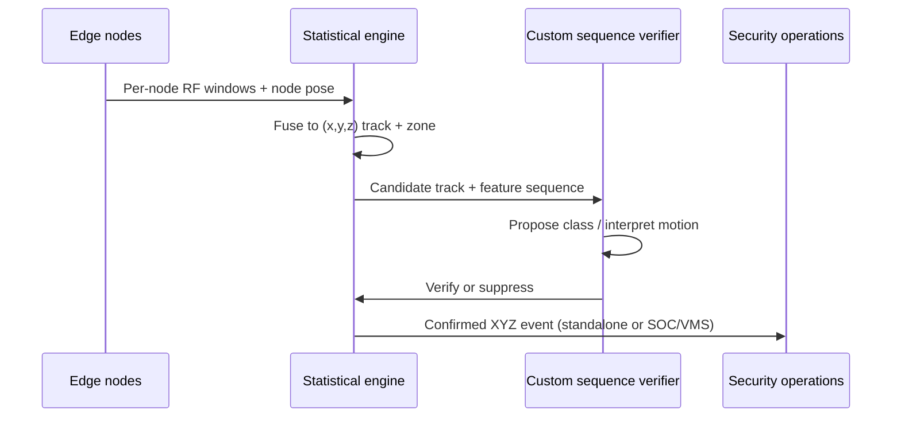

# Portfolio — Wi-Fi Sensing & Sequence Intelligence

**Device-free motion detection today. Zone-based after-hours security tomorrow. Custom sequence models to reduce false alarms.**

## Purpose

This repository is a **job application prototype for Tremium Software**. It packages a working Wi-Fi motion PoC, rigorous ML experiment write-ups, and a product narrative aimed at after-hours retail security.

### Target product (north star)

Build a **standalone or integratable AI-assisted security layer** for a **fixed physical area** (e.g. a shopping mall wing, warehouse aisle, or closed floor):

1. **ESP32 nodes** placed at **regular geometric intervals** on a floor plan (corners, corridor spacing, elevation where needed)—enough density that the volume is **observable**, not just “something moved on the network.”
2. **Site calibration** on that floor (empty-night baseline, furniture map, cleaning windows, known AP layout) so each node’s RF observations map into a **shared coordinate frame**.
3. **Continuous capture of movement as (x, y, z) tracks** over time inside the calibrated volume—plus event metadata (speed class, duration, zone ID, confidence).
4. **Interpretation** via **custom-trained sequence models** documented under [`model-training/`](model-training/) (dual-path propose → verify, leakage-aware training)—to classify motion type, suppress HVAC/cleaning false positives, and support **through-wall** presence where multipath + multi-node geometry allow it (RF sensing, not video).

The system may run **independently** (metadata-only alerts, audit log) or **alongside** existing security (SOC, VMS presets, camera bookmarks on XYZ events)—same events, no dependency on a single vendor stack.

**Today in this repo:** Windows **RSSI PoC** (Python + .NET) proving calibration, VAR/DEL/PTP detection, and operator tooling. **Next engineering:** ESP32 firmware, grid survey tools, fusion service, field retraining of the WHT-LM verifier on site captures.

Technical depth for the **current** sensing stack lives in [`ARCHITECTURE.md`](ARCHITECTURE.md).

---

### Deployment concept (example: mall floor)

| Principle | Detail |
|-----------|--------|
| **Density** | Nodes on a **regular grid** (spacing driven by wavelength, wall materials, and required XYZ accuracy)—more nodes → better multilateration / tomography stability. |
| **Calibration** | Mandatory per site: quiet baseline, anchor positions, zone polygons, optional “truth” walks for supervised alignment. |
| **Output** | Time-stamped **XYZ** (relative to site origin), zone label, motion class, confidence—not identity. |
| **AI role** | [`model-training/`](model-training/) defines **how** we train verifiers; production uses **site-specific** weights on RF time-series from the ESP32 grid. |

---

## Development roadmap (summary)

| Step | Deliverable | Status |
|------|-------------|--------|
| **0** | Windows RSSI engine, calibration, operator UI, test export | **Done** (this repo) |
| **1** | **Site calibration kit** — floor plan, zone polygons, anchor XYZ, day/night profiles | Planned |
| **2** | **ESP32 geometric grid** — synchronized RF samples uplinked with node pose metadata | Planned |
| **3** | **Localization & tracking** — fuse multi-node streams into **(x, y, z)** trajectories inside calibrated volume | Planned |
| **4** | **Custom ML interpreter** — field-tuned sequence model (propose → verify) for motion class + false-alarm suppression | Research documented; field training planned |
| **5** | **Through-wall & occlusion** — denser grid + CSI-capable paths where RSSI-only is insufficient | R&D |
| **6** | **Integration** — standalone dashboard **or** SOC/VMS/API hooks (supporting role, not lock-in) | Planned |

**Honest scope note:** The **delivered PoC** does not yet output XYZ; it validates detection, calibration discipline, and ML methodology. **XYZ + full-area coverage** are explicit **product goals** tied to the ESP32 grid and per-site calibration above—not claims about the current laptop demo.

---

## Vision

Make large retail environments **safer when closed** by using wireless observables as a continuous sensing layer: detect unauthorized movement early, localize activity to **operational zones** (wing, corridor, level), and feed security workflows with auditable, privacy-conscious events.

---

## Mission

Deliver **motion intelligence** from Wi-Fi signal variation—calibrated for empty-night baselines, confirmed through robust statistics and (planned) learned fusion—and escalate only actionable incidents to operators and existing security systems.

---

## Two Workstreams, One Roadmap

| Stream | Status | Role in the product |
|--------|--------|---------------------|
| **Wi-Fi Motion** | Operational PoC | Rule-based detection, calibration, multi-AP hints, test capture, architecture docs |
| **Sequence ML research** | Multi-phase R&D (25+ experiment phases) | Custom sequence models, dual-path verification, rigorous metric validation |
| **Retail security rollout** | Planned | Night baselines, corridor zones, hybrid alerts, operator integration |

---

## Stream 1 — Wi-Fi Motion (delivered)

### What it does

On Windows 11, reads connected-interface RSSI via system WLAN interfaces and nearby BSS entries via the native WLAN API. A sliding window produces:

- **VAR** — variance in linear power (slow / sustained motion)
- **DEL** — step-to-step change (fast motion)
- **PTP** — peak-to-peak range (overall activity)

Optional: RX-rate variance, FFT motion hints, EWMA baseline, up to six AP slots, coarse spatial hint when multiple APs are enabled.

### Implementations in this repository

| Path | Stack | Role |
|------|-------|------|
| [`python/`](python/) | Python 3.13+ CLI | Field scripting, optional automation server |
| [`WifiMotionDotNet/`](WifiMotionDotNet/) | .NET 9 WinForms | Operator UI, live graph, built-in test export (CSV / heatmap) |

Shared configuration: `wifi_motion_config.json` (compatible field names across both stacks).

### Proof points for employers

- End-to-end pipeline documented in [`ARCHITECTURE.md`](ARCHITECTURE.md)
- Calibration → detection → cooldown → logging
- Native WLAN structure corrections in the .NET port (reliable RSSI / channel reads)
- Background detection thread with non-blocking UI (.NET)

---

## Stream 2 — Sequence modeling research (parallel R&D)

A parallel research track on **efficient sequence modeling** and **dual-path decision systems**, run on consumer GPU hardware (RTX 4060 8GB). It is not a Wi-Fi product by itself; it supplies the **ML methodology** for the planned fusion layer.

### Core technical themes

1. **Walsh–Hadamard token mixing (WHT)** — \(O(n \log n)\) mixing vs quadratic attention; studied as a drop-in sequence block.
2. **BCM Hebbian dynamics** — biologically motivated plasticity; T-OPT angle convergence (~81°), visual Gabor-like filters on image probes.
3. **Model1 / Model2 dual path** — asymmetric causal streams with a **sigmoid packet gate** between paths.
4. **Proposal + Verifier framing (B071)** — one path speculates; the other **accepts or rejects** (not blind distillation).

### Selected experimental results (documented internally)

| Area | Result | Implication |
|------|--------|-------------|
| Turkish classification | Up to **98.94%** accuracy (compact hybrid model) | Strong representation learning baseline |
| WHT vs transformer ablation | **~1.0 PPL better**, **~6×** lower gradient norm | Stable, efficient sequence blocks for edge deployment |
| WHT ablation (B045) | With WHT: PPL ~6 / without: PPL ~344 | Mixing mechanism is critical, not decorative |
| Visual BCM (CIFAR) | ~**80–81%** Gabor-like filters, rank ~102/128 | Signal-processing prior emerges from learning rules |
| S3.2 selective gate | Gate usage **~18.8%** (vs ~100% failure mode); `\n` routing evidenced | Sparse, interpretable cross-path routing works |
| Model2-only vs S3.2-A | PPL **4.39 vs 4.33** (clean corpus) | Second path adds measurable value at modest cost |
| **Leakage detection** | Val PPL **&lt; 2.0** flagged as suspect; honest causal runs **~3.5–5.8** | Prevents “too good to be true” metrics in production ML |
| Asymmetric causal (Option A) | Val PPL **3.51**, Δ **−0.88** vs Model2-only | Causal asymmetry without future-information leak |
| Model1 freeze (B070) | Δ **+0.012** PPL when Model1 frozen | Near-reusable encoder—modular deployment |
| Distillation (Option B) | Final PPL **6.60** — failed | Validated that naive distill ≠ verify |

### Methodology transferable to Wi-Fi security

| Research practice | Retail night-security use |
|-------------------|---------------------------|
| Leakage checks on validation metrics | Reject models that “cheat” on empty-mall baselines |
| Dual-path **propose → verify** | Rule-based trip + learned confirm/suppress |
| Sparse gating between streams | Fuse only high-confidence cross-sensor paths |
| Phase tables (25+ documented phases) | Pilot KPIs with reproducible experiment IDs |
| Ablation culture | Keep VAR/DEL/PTP as explainable fallback |

Experiment reports shipped in this repository: **[`model-training/`](model-training/)** (start with [`FINDINGS_SUMMARY.md`](model-training/reports/FINDINGS_SUMMARY.md)).

---

## Planned product — after-hours shopping center security

### Problem

When malls are closed, coverage gaps, patrol cost, and delayed awareness increase risk. Cameras are costly to densify; simple PIR misses complex paths.

### Approach

| Phase | Scope | Outcome |
|-------|--------|---------|
| **0** | Current PoC | Motion yes/no, thresholds, operator tooling |
| **1** | Night profile per site | Empty-building calibration; cleaning-window rules |
| **2** | **ESP32** geometric grid | Regular placement; per-node RF streams + pose; centralized fusion |
| **3** | **XYZ tracking + hybrid ML** | Multi-node localization; custom sequence encoder/verifier on RF time series |
| **4** | Operations | SOC alarms, VMS preset, audit log (time, zone, severity, confidence) |

### What we detect (honest scope)

| In scope (today → planned) | Out of scope (without new sensors / training) |
|----------|-------------------------------------|
| Unauthorized **movement** / presence (PoC today) | Person identity / face |
| **Planned:** **(x, y, z)** tracks over calibrated floor (ESP32 grid + fusion) | Guaranteed zero false alarms |
| **Zone** + wing / corridor labels | “See through walls” as **video** |
| **Planned:** motion **behind walls** via multi-node RF + custom ML (step 5) | Sub-centimeter RTK without survey anchors |
| Standalone **or** SOC/VMS-integrated operation | |
| Event duration, speed class, confidence | |

### Hybrid detection architecture (planned)

- **Propose:** multi-node pattern suggests intrusion vs benign (cleaning, HVAC).
- **Verify:** causal/conservative path must agree before escalation (research parallel: Model2-style verifier).
- **Fail-safe:** low ML confidence → rule-only alert or human review queue.

### Corporate objectives (measurable targets for pilots)

1. **Early awareness** — confirmed motion to operators within seconds.  
2. **Zone actionable** — every alert tagged to a floor plan region, not raw RSSI.  
3. **Night-ready** — separate closed vs open building profiles.  
4. **Trust** — metadata-only RF events; video remains a separate, policy-controlled channel.  
5. **Pilot KPIs** — false alarms per zone per night, median detection latency, operator acknowledgement time.

---

## Strategic goals (summary)

| Goal | Today | Planned |
|------|-------|---------|
| Device-free sensing | ✅ RSSI pipeline | ESP32 geometric grid |
| Spatial output | Zone hints only (PoC) | **(x, y, z)** tracks after calibration |
| Explainable core | ✅ VAR / DEL / PTP | + ML cause codes |
| Learned fusion | Documented ML methodology | Site-trained sequence verifier |
| Deployment mode | PoC UI / logs | Standalone **or** SOC / VMS / API |
| Rigorous ML culture | Leakage + ablation discipline | Same gates on field models |

---

## Elevator pitch

> We already turn Wi-Fi RSSI into calibrated motion intelligence with operator-ready tooling. Next we scale to **after-hours retail security**: zone-based intrusion alerts from a distributed sensor grid, fused by **custom sequence models** trained with the same rigor as our dual-path research—rule-based safety first, learned verification second, operations integration third.

---

## Document map

| File | Contents |
|------|----------|
| [`README.md`](README.md) | Repository overview & quick start |
| [`ARCHITECTURE.md`](ARCHITECTURE.md) | Wi-Fi sensing pipeline & code mapping |
| [`PORTFOLIO.md`](PORTFOLIO.md) | This file — vision, ML findings, retail roadmap |
| [`model-training/README.md`](model-training/README.md) | Model training program — report index |
| [`model-training/reports/FINDINGS_SUMMARY.md`](model-training/reports/FINDINGS_SUMMARY.md) | Phase table & proven findings |
| [`model-training/reports/bcm/OVERVIEW.md`](model-training/reports/bcm/OVERVIEW.md) | BCM experiments (vision, language, S3.2-B) |
| [`python/README.md`](python/README.md) | CLI usage |
| [`WifiMotionDotNet/README.md`](WifiMotionDotNet/README.md) | Desktop app usage |

---

## Model training evidence (in-repo)

| Report | Topic |
|--------|--------|
| [`model-training/reports/FINDINGS_SUMMARY.md`](model-training/reports/FINDINGS_SUMMARY.md) | All phases — executive summary |
| [`model-training/reports/INDEX.md`](model-training/reports/INDEX.md) | Full report catalog |
| [`model-training/reports/S1_WHT_ABLATION.md`](model-training/reports/S1_WHT_ABLATION.md) | WHT vs transformer |
| [`model-training/reports/bcm/WHT_ABLATION_B045.md`](model-training/reports/bcm/WHT_ABLATION_B045.md) | WHT vs ReLU — 56× PPL gap |
| [`model-training/reports/bcm/S3_2_GATE_BCM_RESULTS.md`](model-training/reports/bcm/S3_2_GATE_BCM_RESULTS.md) | S3.2 gate + BCM (Model1 / Model2) |
| [`model-training/reports/LEAKAGE_ANALYSIS_B076.md`](model-training/reports/LEAKAGE_ANALYSIS_B076.md) | Leakage analysis |
| [`model-training/reports/PROPOSAL_VERIFIER_B071.md`](model-training/reports/PROPOSAL_VERIFIER_B071.md) | Proposal + verifier |
| [`model-training/reports/MODEL2_ONLY_BASELINE_B069.md`](model-training/reports/MODEL2_ONLY_BASELINE_B069.md) | Model2-only baseline |

